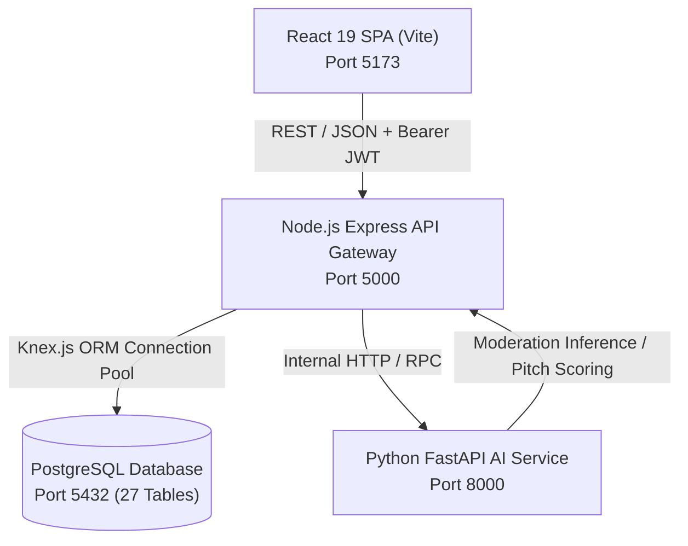
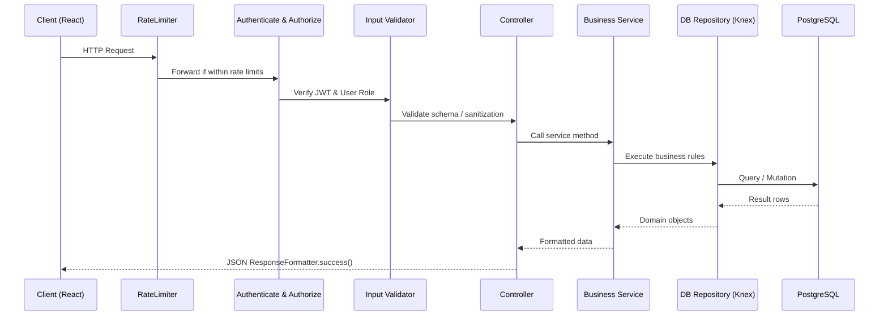

# System Design Document (SDD)
## TeenPreneur Hub: System Architecture & Design

**Version**: 1.0.0  
**Date**: September 14, 2026  
**Degree**: Master of Computer Applications (MCA) Mini Project  
**Author**: Muhammed Althaf O K  

---

## 1. Architectural Architecture & Design Principles

### 1.1 Architectural Style
TeenPreneur Hub employs a **Layered Service-Oriented Architecture (SOA)** featuring:
- A Single Page Application (SPA) client written in **React 19** and bundled with **Vite**.
- A Core API Gateway & Business Engine written in **Node.js / Express**.
- An AI and NLP Microservice written in **Python (FastAPI)** for intelligent content moderation and pitch analytics.
- A high-reliability Relational Database management layer backed by **PostgreSQL** accessed via the **Knex.js** query builder.



### 1.2 Design Principles
1. **Separation of Concerns**: UI, API routing, business services, data repositories, and database schemas are decoupled.
2. **Defense in Depth**: Multi-layer security including CORS filtering, Helmet headers, IP rate limiting, parameter validation, JWT verification, and RBAC authorization guards.
3. **Child Safety by Design**: Invariant checks for minor age verification, mandatory parental consent before account activation, and zero unmonitored communication channels.

---

## 2. Component Design & Layering (Node.js Server)

The server is structured cleanly into distinct layers:
```
server/
├── src/
│   ├── config/          # Environment, Auth, Database, Winston Logger, Constants
│   ├── middleware/      # Authenticate, Authorize, Validate, RateLimiter, ErrorHandler
│   ├── routes/          # Express route definitions
│   ├── controllers/     # HTTP request/response handlers
│   ├── services/        # Core business logic
│   ├── repositories/    # Database query operations (Knex)
│   └── utils/           # ApiError, ResponseFormatter, Helpers
├── database/
│   ├── migrations/      # 27 Knex migration files
│   └── seeds/           # Comprehensive demo seed data
└── tests/               # Unit & integration test suites
```

### 2.1 Request Lifecycle


---

## 3. Python AI & Content Moderation Microservice

### 3.1 Role & Responsibilities
While Node.js handles real-time API traffic and transactions, the Python service acts as an intelligent safety layer:
1. **NLP Content Moderation Engine**:
   - Analyzes text for toxic sentiment, profanity, harassment, and grooming indicators.
   - Detects private contact information (phone numbers, WhatsApp links, Instagram/Snapchat handles, personal emails) to prevent off-platform interactions with minors.
2. **Pitch Evaluation & Idea Scoring**:
   - Assesses business idea novelty, market feasibility, and clarity using heuristic scoring models.
3. **Mentor-Founder Matching**:
   - Calculates cosine similarity between student industry tags and mentor expertise vectors.

---

## 4. Frontend UI/UX Architecture

The client application is organized for high visual appeal and accessibility:
- **Design Tokens**: Standardized CSS custom properties for spacing, typography, gradients, glassmorphism, and dark/light modes.
- **Role-Based Portals**:
  - `/student/*`: Ideation canvas, startup manager, milestone roadmaps, course player.
  - `/guardian/*`: Linked children summary, consent requests, read-only chat logs.
  - `/mentor/*`: Assigned startups, milestone review board, pitch scorecard.
  - `/admin/*`: KPI metrics, verification approvals, content moderation queue.
